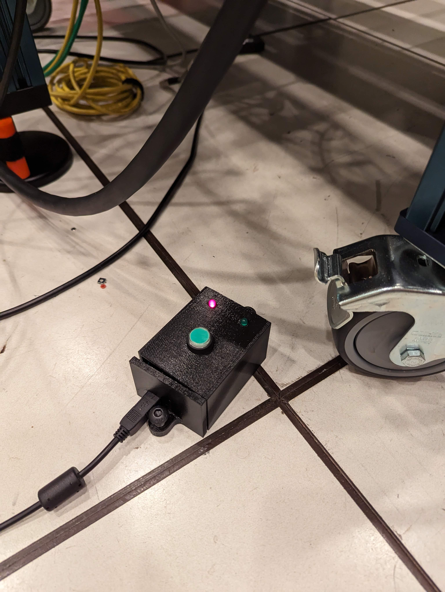

The Vention Rail Hardware Interface communicates through 

# Overview 
In the initialization stage of the hardware interface, the rail homes itself, which moves all the way to the motor side of the rail. To make sure that as the rail homes, it will not collide with anything throughout the move, we have set up an interface that requires an operator to press a button located underneath the driver computer. When the hardware interface starts, it will prompt the user with the following message (which will be mixed with other controller messages waiting for hardware interfaces to start).
```
PLEASE PRESS THE SAFETY BUTTON TO START HOMING
```

An operator should then walk to the robot, verify that the rail will not come into collision with any other objects when it homes, and afterwards, press and hold the green button (see below). Once the green light is turned on, the rail should start homing, and you can release the button.

{width=50%}

# How it works
An arduino is running inside of the box which is plugged into the computer through a usb cable and communicates through a serial interface. This arduino is set up through udev rules to have a symlink to `/dev/safety_com_port`, which is the serial interface that the [vention rail hardware interface](vention_rail_hardware_interface/src/vention_rail_hardware_interface.cpp) is looking for. 

If the hardware interface finds the arduino, the hardware interface sends a message, `poll`, to the arduino. The arduino checks every 250ms for a poll, and if it recieves a poll, it will check to see if the button is pressed. If the button is pressed, the arduino will send the value `113`, and light up the green button, and if it is not pressed, it will return `86` (number chosen so that it would require more than one bit flip to be wrong). The hardware interface checks whether the value returned was 113, and if it was, it moves on with the remainder of the rail configuration, including the homing.

The arduino code lives [here](https://js-er-code.jsc.nasa.gov/imetro/robots/chonkur-l-rail-e/clr_safety_button/-/tree/CLR_Homing_Button?ref_type=heads)


